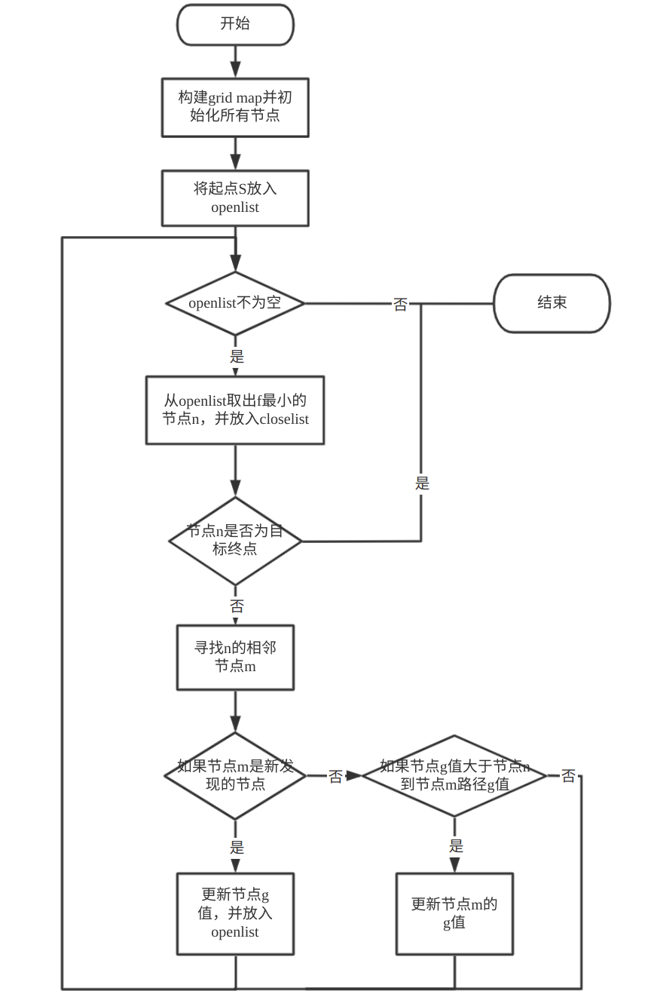
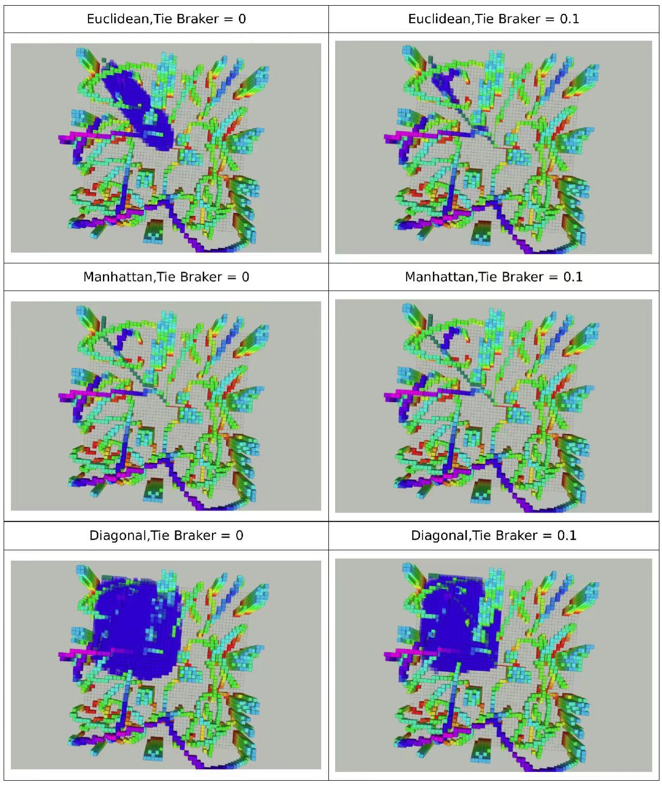

# 第二章作业 - Search-Based Method

## 算法流程
1. 构建grid map，初始化每个节点
2. 将起点S放到openlist
3. 循环以下步骤  

    a. 当openlist为空时，则结束循环（此时未找到有效路径）  
    b. 从openlist取出f最小的节点n，并标记为扩展节点，放到closelist  
    c. 当节点n是目标节点，则结束循环，此时已找到有效路径  
    d. 通过n节点寻找所有未扩展的相邻节点m  

        i. 如果m为新发现的节点，则更新m的g值g(m)=g(n)+Cnm，并将其放到openlist  
        ii. 如果m已在openlist，当g(m) > g(n) + Cnm，则更新m的g值g(m)=g(n)+Cnm  

4. 回溯，获取路径  

## 运行结果对比
下图展示不同启发函数和是否使用Tie Braker的运行结果。

## 问题
1.在编译运行时，发现程序在开启首次运行时存在崩溃现象，后发现terminatePtr在初始化时并不是默认的nullptr，后在类中将terminatePtr初始化为nullptr  
2.在调试查看结果时，发现如图所示的情况下，节点m依然会被扩展为n的邻近节点，且路径有可能从n指向m。原因为在考虑节点扩展时，把节点认为是质点。如果要处理该情况，可以考虑节点扩展方向和m节点的邻域连通情况，从而剔除这种不合理的扩展。

