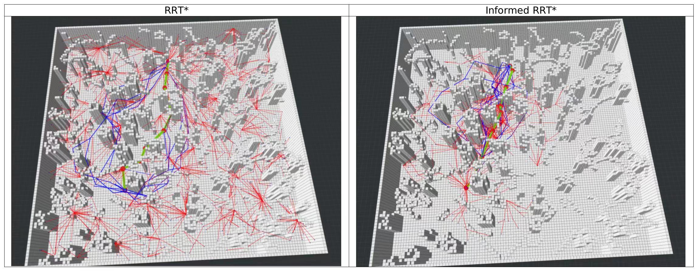

# 第三章作业 - Sampling-Based Method
## 算法流程（RRT*）
1.构建地图，初始化所有节点  
2.循环，直至超过限定采样时间或采样节点数 

    a)随即采样得到Xrand  
    b)获取Xrand的就近点Xnear  
    c)在Xnear和Xrand连线之间按一个步长选取Xnew  
    d)如果Xnew和Xnear连线不碰撞，则(i)按一个半径圆内寻找邻近点，(ii)选择代价最小的作为父节点，并将该节点加入到树中，(iii)在邻近点中寻找Xnew节点的子节点,如查找到可调整的节点，重新修改节点连接关系，并更新该节点所有后续节点代价  

3.回溯获得路径
## 实现效果
项目工程中实现了RRT\*和Informed RRT\*两种算法，使用宏定义use_informed_RRTstar进行配置。
```C++
#define use_informed_RRTstar 0  // 禁用Informd采样
#define use_informed_RRTstar 1  // 启用Informd采样
```
算法运行结果如下：  

## 所遇问题
- Informed RRT*从2D扩展到3D时，从椭圆扩展到椭球进行均匀采样，具体的内容参考[这篇文章](https://www.zhihu.com/question/268718682/answer/471626663) 
