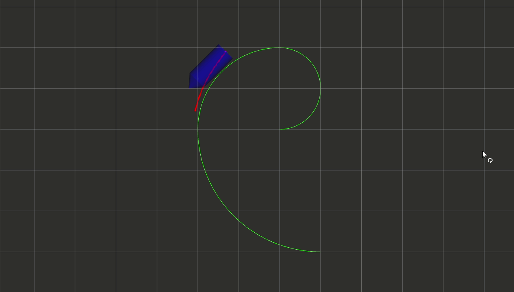

# 第六章作业
## 公式推导
- 建立车辆动力学模型（使用简化的二自由度自行车模型）

  $$\begin{cases} \dot{p_x} = vcos\phi \\ \dot{p_y} = v sin\phi \\ \dot{\phi} ={v\over L}tan\delta \\ \dot{v} = a \end{cases}$$

- 对系统状态方程进行线性化和离散化
  系统状态方程表示为$x_{K+1} = A*x_k + B*u_k + C$，对非线性模型离散化可得：

  $$x_{k+1} = x_k + \dot{x_k}(x_k,u_k)dt$$

  在位置进行泰勒展开，并结合动力学模型，最终得到系统线性化离散状态方程：

  $$x_{k+1} = (I + dt* A_c)x_k + dt * B_c U_k + dt*g_c$$

  其中$A_c = \left[ \begin{matrix} 0 & 0 & -\bar{v}sin\bar{\phi} & cos\bar{\phi} \\  0 & 0 & \bar{v}cos\bar{\phi} & sin\bar{\phi} \\  0 & 0 & 0 & tan\bar{\delta}\over L \\  0 & 0 & 0 & 0   \end{matrix} \right]$,$B_c = \left[ \begin{matrix} 0 & 0  \\  0 & 0  \\  0 & - \bar{v} \over {Lcos^2\bar{\delta}} \\  1 & 0   \end{matrix} \right]$,$g_c = \left[ \begin{matrix} \bar{v}\bar{\phi}sin\bar{\phi} \\  -\bar{v}\bar{\phi}cos\bar{\phi}   \\  0 \\  - \bar{v}\bar{\delta} \over {Lcos^2\bar{\delta}}  \end{matrix} \right]$

- 目标函数与约束

  目标函数只考虑了位置和角度的跟踪偏差，输入的幅值以及相邻两个输入平滑在约束中考虑

  $$J = \sum_{i=1}^N (x-x_r)^2+ (y-y_r)^2 + rho * (phi-phi_r)^2$$

  $$\begin{aligned}
  s.t. -0.1 \leq v_k \leq v_{max} \\
       |a_k| \leq a_{max} \\
       |\delta_k| \leq \delta_{max}\\
       {|\delta_{k+1} - \delta_k| \over dt} \leq d\delta_{max}
  \end{aligned}$$


## 实现效果
<p align="center">
    
</p>


## 所遇问题
1. 初始阶段路径跟踪偏差过大，后续慢慢修正并跟踪到参考路径上
2. 算法运行耗时大，在Intel® Core™ i7-10710U CPU @ 1.10GHz × 12及Ubuntu20.04中osqp求解需25～30ms
3. 处理${|\delta_{k+1} - \delta_k| \over dt} \leq d\delta_{max}$这个约束时，考虑$u_0$时需引入预测值

```c++
    lu_.coeffRef(2, 0) = predictInput_.front()(1) - ddelta_max_ * dt_;
    uu_.coeffRef(2, 0) = predictInput_.front()(1) + ddelta_max_ * dt_;
```

1. 处理和更新$x_{K+1} = A*x_k + B*u_k + C$时，不要忘记常数项处理

```c++
      if (i == 0) {
        BB.block(0, 0, n, m) = Bd_;
        AA.block(0, 0, n, n) = Ad_;
        gg.block(0, 0, n, 1) = gd_;
      } else {
        BB.block(i * n, i * m, n, m) = Bd_;
        BB.block(i * n, 0, n, i * m) = Ad_ * BB.block((i-1) * n, 0, n, i * m);
        AA.block(i * n, 0, n, n) = Ad_ * AA.block((i - 1) * n, 0, n, n);
        gg.block(i * n, 0, n, 1) = Ad_ * gg.block((i-1) * n, 0, n, 1) + gd_;  // const
      }
```

------

# 参考资料

[轨迹跟踪—线性 MPC 控制算法](https://blog.csdn.net/robochengzi/article/details/124234469)

[基于模型的强化学习—LQR与iLQR](https://zhuanlan.zhihu.com/p/109519608)

[自动驾驶控制算法实例之模型预测控制（MPC）--从模型推导到代码实现（以Autoware为例）](https://zhuanlan.zhihu.com/p/358836526)
