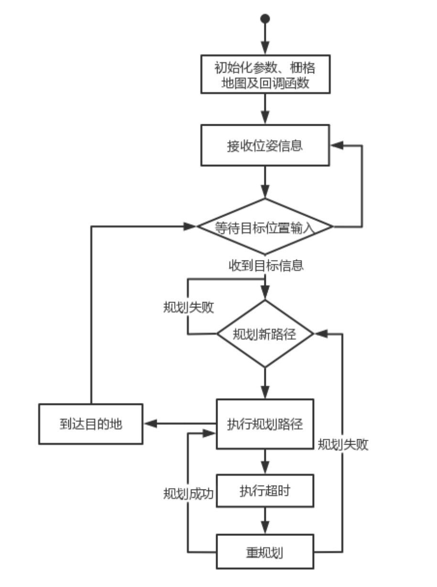

# 课程大作业
# 准备

- libopenblas-dev liblapack-dev libarpack-dev libarpack2-dev libsuperlu-dev

OpenBLAS(Open Basic Linear Algebra Subprograms)是开源的基本线性代数子程序库，是一个优化的高性能多核BLAS库，主要包括矩阵与矩阵、矩阵与向量、向量与向量等操作

LAPACK(linear algrebra package)著名的线性代数库，fortran语言编写，底层是BLAS，在此基础上定义了很多矩阵和向量高级运算的函数，如矩阵分解、求逆和求奇异值等，该库的运行效率比BLAS库高

arpack(arnoldi package)求解大型本征方程的程序库，主要算法是arnoldi循环，最初fortran编写。如果要求密矩阵的本征问题，没必要使用Arpack，直接使用Lapack即可。

SuperLU是用于高端计算机的大型稀疏非对称线性方程系统的直接求解器，由C实现，接口可以被C/fortran调用

- Armadillo

Armadillo是基于C++的高质量线性代数库（矩阵数学），旨在在速度和易用性之间实现良好的平衡。

- - 提供类似于Matlab的高级语法和功能；
  - 可用于直接在C++中开发算法，或将研究代码快速转换到生产环境（如软件和硬件产品）；
  - 为矢量、矩阵和多维数据集（第一阶、二阶和三阶张量）提供高效的类，支持密集和稀疏矩阵；
  - 支持整数、浮点和复数；
  - 通过与LAPACK集成来提供各种矩阵分解或其高性能替换（例如多线程Intel MKL或OpenBLAS）；
  - 复杂的表达式评估器（基于模板元编程）自动组合多个操作以提高速度和效率；
  - 可以自动使用 OpenMP 多线程（并行化）来加速计算高成本的操作；
  - 在许可下可使用，适用于开源和专有（非源代码）软件；
  - 可用于机器学习、模式识别、计算机视觉、信号处理、生物信息学、统计学、金融等。

> 上述内容来源于互联网

# trajectory_generator_node运行流程图




# 所遇问题

1. 在首次配置和编译工程时，使用PLUGINLIB_DECLARE_CLASS导入插件无法编译通过，修改为以下内容

```c++
// 由于我使用的ros版本为noetic
#include <pluginlib/class_list_macros.h>
// PLUGINLIB_DECLARE_CLASS(so3_control, SO3ControlNodelet, SO3ControlNodelet,nodelet::Nodelet);
PLUGINLIB_EXPORT_CLASS(SO3ControlNodelet, nodelet::Nodelet);
```
